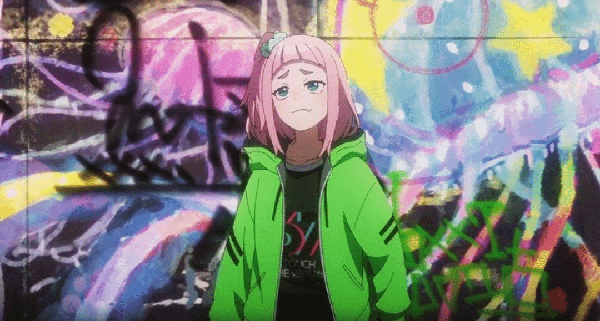

<!-- INTRO GIF -->

  

<!-- TYPING HEADING -->
<h1 align="center">
  
</h1>

  <strong>I build products that feel alive — clean engineering with creative storytelling.</strong>

---

<!-- BADGES -->

  
  
  
  

---

<!-- WAVE GIF -->
  

  

## 🚀 About Me  
- 💻 MERN stack developer turning ideas into production-ready products  
- 🤖 Building AI-powered apps that solve real problems  
- 🔥 Strong in backend architecture, APIs & clean code  
- 🧠 DSA practitioner (C++ / LeetCode)  
- ✨ Obsessed with building tools that save time & look beautiful  

---

<!-- TECH TRANSITION GIF -->

  

## ⚙️ Tech Stack

**Languages:** JavaScript, TypeScript, Python, C++, C  
**Frontend:** React.js, Next.js (App Router), TailwindCSS, HTML, CSS  
**Backend:** Node.js, Express.js, REST APIs, Convex (real-time backend)  
**Real-Time Systems:** Stream Video SDK, WebSockets  
**Databases:** MongoDB, Firebase, Supabase, SQL, Convex Storage  
**AI & Processing:** Gemini API, Vapi, PDF/DOCX Parsing, Speech-to-Text, Prompt Engineering  
**DevOps & Tools:** GitHub, Vercel, Netlify  

### 🌸 Languages  

### 🌸 Frontend  

### 🌸 Backend  

### 🌸 Real-Time & Media  

### 🌸 Databases  

### 🌸 AI & Processing  

### 🌸 Algorithms  

### 🌸 DevOps & Tools  

---

<!-- Project gif -->

  

## 🌱 Currently Building  

  🌸 Currently refining and building these projects with clarity and focus. 🌸

---

<!-- GITA -->

### 🔥 GITA — AI-Powered Study Generator  
A tool that reads syllabus PDFs/DOCX and generates structured exam-ready content.

**Currently working on:**  
- 🖼️ Improving PDF/DOCX parsing, especially files with images  
- ⚡ Faster, cleaner topic extraction & ranking  
- 🧾 Better structured notes + exam-style Q/A  
- 🖌️ Diagram/image extraction improvements  
- 🚀 Reducing response time through optimized prompts  

---

<!-- ECHOHIRE -->

### 🎤 EchoHire — Complete AI Interview Ecosystem  
A full platform for interviews with real-time video, live coding, scheduling, recordings, and AI feedback.  
*(Based on your EchoHire document)*

**Currently developing:**  
- 🎥 Real-time video interview flow using **Stream SDK**  
- 💻 Integrated **live coding environment** inside interview UI  
- 🗂️ **Convex scheduling** with real-time updates  
- 📼 Auto **interview recordings** + storage mapping  
- 🤖 More natural **AI interviewer behavior**  
- 📝 Structured scoring + transcript feedback  
- 🧭 Smoother interviewer dashboard + multi-round support  

---

<!-- WORKMATE -->

### 👥 WorkMate — Student Job Matching Platform  
A lightweight, fast job-matching tool for students & local providers.  
*(Based on your WorkMate proposal)*

**Currently working on:**  
- 🧑‍💼 Clean role-based dashboards (Student / Provider)  
- 🎨 Light/dark UI polish  
- 📦 Job posting + management (localStorage + Context API)  
- 🧠 Designing future intelligent features:  
  - 🧭 **Dijkstra’s Algorithm** → nearest job suggestions  
  - 🔢 **Hungarian Algorithm** → optimal student-job matching  
- ⭐ Adding profiles, ratings, and analytics  

  🌸 Steady upgrades. Quiet focus. Better every day. 🌸

---

<!-- MUSIC GIF -->

  

 ## 🎧 Hobbies 
 
- 🎵 Vibing to music & Lo-fi  
- 🎨 Anime art, aesthetics & digital creativity  
- 🎮 Gaming  
- ⚡ Enjoying speed & peace  
- ✈️ Travelling to new places  
- 📚 Reading mindset & self-growth books  
- ✍️ Writing thoughts, ideas & stories  

---

## 📊 GitHub Overview  

  

---

## 🌱 Activity Graph  

  

---

<!-- TIRED GIF -->

  

## 😮‍💨 That's all… I'm tired now  
Thanks for stopping by — feel free to connect anytime!  

<b>⭐ If you like my work, consider giving a star!</b>

