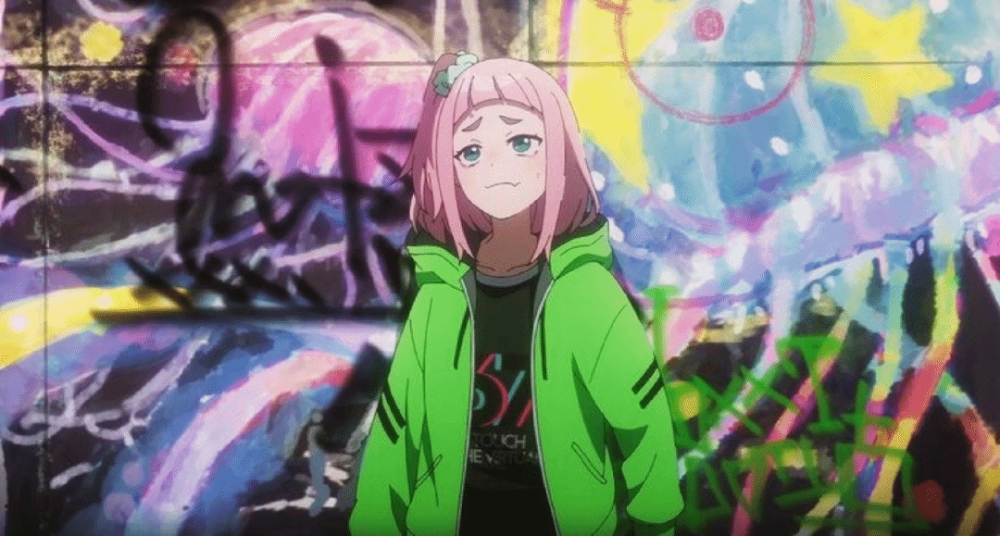
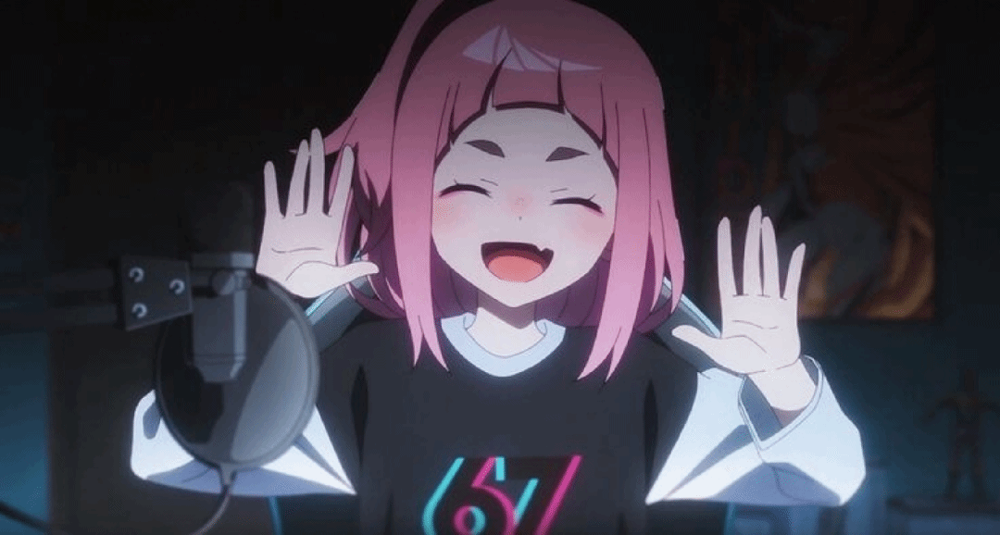

<!-- INTRO GIF -->

  

<h1 align="center">
  
</h1>

<!-- ABOUT ME -->
<h2 align="center">About Me </h2>

  Developer who enjoys <b>building from scratch, solving problems, and figuring out how things work.</b>

<ul>
  <li> Turning ideas into <b>real-world products</b></li>
  <li> Building <b>full-stack & real-time applications</b></li>
  <li> Exploring <b>AI-powered experiences</b></li>
  <li> Practicing <b>DSA & problem solving</b> with C++</li>
  <li> Learning <b>backend systems, APIs & scalable architecture</b></li>
  <li> Believing the best way to learn is to <b>build, break, and rebuild</b></li>
</ul>

---

<!-- TECH TRANSITION GIF -->

  

## ⚙️ Tech Stack  

  <!-- main tech icons row -->
  
  
  
  

---

## 🚀 Featured Projects  

<!-- Project gif -->

  

  🌸 Fully built projects showcasing problem-solving and real-world execution. 🌸

---

<!-- GITA -->

### 🔥 GITA — AI-Powered Study Generator  
A tool that reads syllabus PDFs/DOCX and generates structured exam-ready content.

**Currently working on:**  
- 🖼️ Improving PDF/DOCX parsing, especially files with images  
- ⚡ Faster, cleaner topic extraction & ranking  
- 🧾 Better structured notes + exam-style Q/A  
- 🖌️ Diagram/image extraction improvements  
- 🚀 Reducing response time through optimized prompts  

---

<!-- ECHOHIRE -->

### EchoHire 
A full platform for interviews with real-time video, live coding, scheduling, recordings, and AI feedback.  

**Currently developing:**  
- 🎥 Real-time video interview flow using **Stream SDK**  
- 💻 Integrated **live coding environment** inside interview UI  
- 🗂️ **Convex scheduling** with real-time updates  
- 📼 Auto **interview recordings** + storage mapping  
- 📝 Structured scoring + transcript feedback  
- 🧭 Smoother interviewer dashboard + multi-round support  

---

  🌸 Steady upgrades. Quiet focus. Better every day. 🌸

---

 ## 🎧 Hobbies 

 <!-- MUSIC GIF -->

  

 
- 🎵 Vibing to music & Lo-fi  
- 🎨 Anime art, aesthetics & digital creativity  
- 🎮 Gaming  
- ⚡ Enjoying speed & peace  
- ✈️ Travelling to new places  
- 📚 Reading mindset & self-growth books  
- ✍️ Writing thoughts, ideas & stories  

---

<!-- FOOTER -->
<h2 align="center">😮‍💨 That's all... I'm tired now.</h2>

  Thanks for making it this far. 🌸

<!-- ENDING GIF -->

  

 

  <b>Let's stay connected ↓</b>

  

  

 

  <i>And that's where I disappear back into the terminal.</i> 🌙
    
  Until the next commit. 👋

